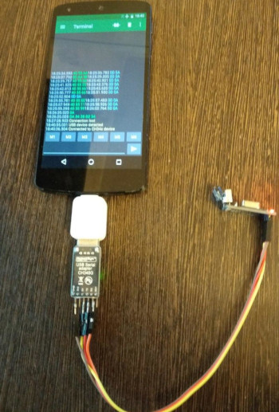

# serialIrConvert
Convert IR from serial console to hex code for [irplus](https://irplus-remote.github.io) android app

Read tools:
* [usb ttl](https://aliexpress.com/af/usb-ttl.html?SearchText=usb+ttl)
* [IR Decoder receiver](https://aliexpress.com/af/diy-ir-decoder-5v-receiver.html?SearchText=diy+ir+decoder+5v+receiver)
* [usb OTG](https://aliexpress.com/af/usb-otg.html?SearchText=usb+otg)
* [Serial USB Terminal APK](https://play.google.com/store/apps/details?id=de.kai_morich.serial_usb_terminal&hl=ru)


# Install
```bash
git clone https://github.com/drudrum/serialIrConvert.git
cd serialIrConvert
npm install
```

# Example
```bash
node app --hex 209F09
Your code is : 04 f9 90 6f
```
